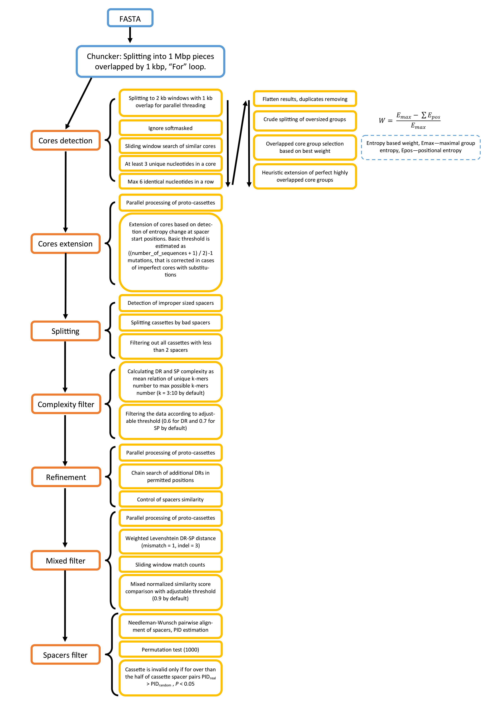

# SIRCFinder

# **Introduction**

The SIRCFinder package provides functions for genome-wide SIRC
detection. SIRC – Short Interrupted Repeats Cassettes are interspersed
repetitive DNA elements, consisted of direct repeats interrupted by
diverse spacer sequences, similar to prokaryotic CRISPR and STAR-like
elements [(Gorbenko et al., 2023)](https://doi.org/10.3390/ijms241311116).
The function of SIRC in eukaryotic genomes remains unknown, still the
elements are useful for various bioinformatic research that improve our
knowledge on complex processes of genome regulation and functions. Also,
the elements are helpful as stable anchors for synteny analysis.

# **Installation**

``` r
library(devtools)
# Install SIRCFinder from GitHub
devtools::install_github("Daynoru/SIRCFinderv2")
```

# **Usage**

``` r
library(SIRCFinder)

# Detect SIRC elements
results <- SIRCFinder("path_to_fasta_file")

# Convert results
gr <- convert_to_granges(results) 
dna <- convert_to_DNA(results, "Cassettes", "path_to_fasta_file")

# Distance analysis
dm <- percon_distance_matrix("path_to_fasta_file")

# Remove scaffolds
unscaffold(c("path_to_fasta_file1", "path_to_fasta_file2"))
```

# **Principle**

The package main function SIRCFinder() is the full C++ implementation of
algorithm, powered by Rcpp. The algorithm includes 7 main parts. First,
the input sequences are separated by chunks (1Mbp by default). Then the
1st part “Cores detection” performs parallel search of imperfect (80%
identidy by default) direct repeats in a sliding window (2000 kb by
default). The algorithm bypasses soft masked regions as well as low
complexity regions. The found core groups, or protocassettes, are
separated to insure proper spacer-DR size proportions. In case of
overlaps – the protocassette with best entropy weight is chosen. In
cases of perfect core groups overlapped (W = 1) – heuristic algorithm
performs merge of protocassettes DRs resulting in extension of DR
lengths. The 2nd part “Cores extension” detects proper DR-spacer
boundaries by scanning the protocassette for rapid Shannon entropy jump
that occurs in spacer start position. The 3rd part “Splitting” performs
protocassette splits in cases of improper-sized spacers. Sequentially
all resulting protocassettes of improper DR number are being deleted.
The 5th part “Refinement” performs additional genome analysis to add
missed DRs to protocassettes. The 6th and 7th parts are filters that
compares spacers to DR consensus and spacers with spacers respectively
to ensure no tandem repeats passed through the pipeline by mistake. The
result is R List containing DR consensus, DR length, genomic positions
of DR start, DR sequences and scanned sequence name.




The function percon_analysis() takes fasta as input and performs full
analysis on SIRC pairwise comparisons by calculation of PERCON ro values [(Kazakov et al., 2003)](https://doi.org/10.1016/S0888-7543(03)00182-4), formation of a fully-connected graph with label propagation algorithm
community detection, minimum-spanning tree construction of a graph, and
in cases of interspecies comparisons performs (argument interspecies =
TRUE) performs AMOVA-like analysis calculating F-statistics, P-value and
R2 to score the interspecies phylogenetic signal strength. For
interspecies analysis, the sequence names in fasta file must contain
species names and sequence names separated with “_”.

# **Performance**

The SIRCfinder package was tested on Ryzen 5 3600X with B550 motherboard
chipset and 48 Gb RAM – the analysis for 10 genomes presented in a
current study took about 3 hours of time and near 16 Gb of RAM usage.
The authors want to emphasize that SIRCFinder() function of SIRCfinder R
package is suited for assembled genomes, not for scaffolds or raw reads
data analysis – since high number of sequences in input fasta file may
cause the chunk number estimation to fail.

## **Session Info**

R version 4.2.3 (2023-03-15 ucrt) Platform: x86_64-w64-mingw32/x64
(64-bit) Running under: Windows 10 x64 (build 19044)

Matrix products: default

locale: [1] LC_COLLATE=Russian_Russia.utf8 LC_CTYPE=Russian_Russia.utf8
LC_MONETARY=Russian_Russia.utf8 [4] LC_NUMERIC=C
LC_TIME=Russian_Russia.utf8

attached base packages: [1] stats graphics grDevices utils datasets
methods base

loaded via a namespace (and not attached): [1] compiler_4.2.3
tools_4.2.3
